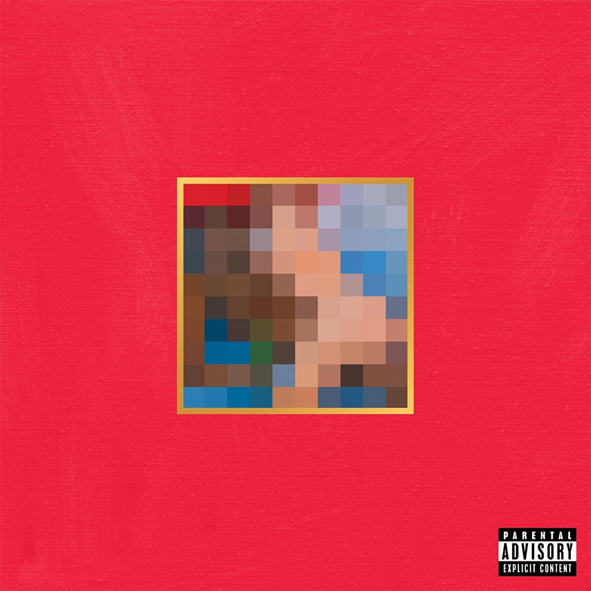

最近一个月做事和路上常听的几张专辑，确实顶。

<!-- truncate -->

## MBDTF

来自 kanye West 的《My Beautiful Dark Twisted Fantasy》，发行在 2010 年。

来自 Apple Music 的评论：

> 2009 年 MTV 颁奖典礼上“抢话筒”的闹剧让 Kanye West 成为媒体的众矢之的，而久久未发新作更是让众人对他的音乐创造力发出质疑，多方压力让 Kanye 陷入精神压力下的情绪低谷。而《My Beautiful Dark Twisted Fantasy》这张史诗级的唱片宣告了 Kanye West 涅槃重生式的回归，专辑的出色也打消了外界顾虑。在夏威夷“自我流放”的日子里，Kanye 记录下逃避现实、自我怀疑等颓废之态，书写下对财富、浪漫、享乐主义等的思考。专辑中 R&B、灵魂乐、电子乐、交响乐在 Kanye 麾下展示精彩，而专辑整体巴洛克式的概念更是把嘻哈音乐推向了艺术形式新高度。众多国际一线艺人鼎力相助，令这张专辑在旋律构思、器乐编排上华美造极。暌违两年，侃爷用努力和杰作向我们展示了他超前的音乐格局，并再次荣获格莱美最佳说唱奖项。

第一首 intro 直接就抓人，先进伦敦腔朗读。然后来一个磅礴的 hook：Can we get much higher？。
连续重复之后，经典伴奏，Ye 出场。中间继续穿插同样的 hook，并以此结束 intro。
intro 直接确定了整张专辑的基调：风格的融合，杂糅却敲到好处的配器和音色，不得不让人赞叹，Ye 在音乐上确实是天才。

《All of the Lights》，之前就听过，是 2K 系列的主题曲。很少有说唱作品中出现管乐，添加了很合适的戏剧感和史诗感，更有豪华整容 Rihanna 唱 hook。
