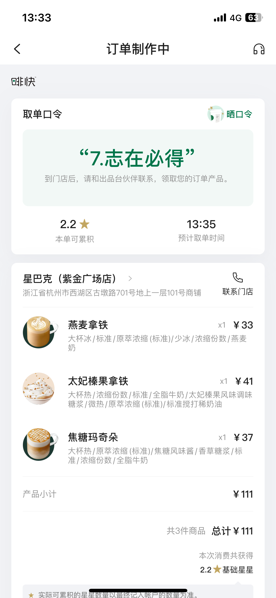
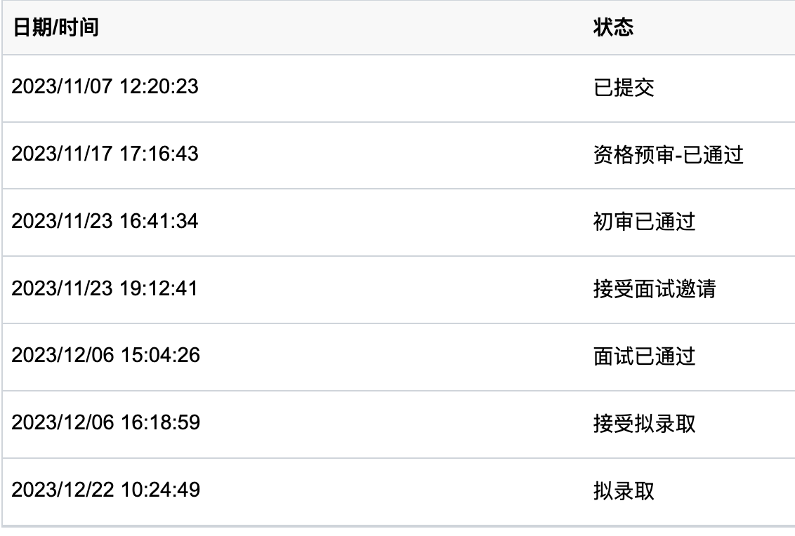
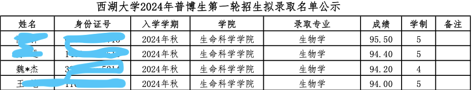

分享一下 2024 年西湖大学生命科学学院博士申请上岸历程和经验

<!-- truncate  -->

## 结果

其实离申请结束，已经有了一段时间。记得很清楚，那天是 23 年的 12 月 6 日，是周三的下午收到的邮件。知道拟录取的第一刻，说真的，内心还是很激动的，马上把结果分享给了家人们。大约过了几秒钟，我双手掩面，回想半年多来的历程和决定，仿佛自己的内心和未来是个空谷，向其呐喊，终于得到回响。

当然很快就平静下来了，请几个好厚密们去步行街喝奶茶，晚上又请吃了一顿好的。隔了一天又请另外几个好朋友喝酒，开了家里的女儿红，喝完打惯蛋打到 12 点，放纵了有点。

## 历程

接下来分享一下申请的心路历程，如果能给别人带来帮助，是最好不过的了。

### 选择

并不是开玩笑，这恰恰是最难走出的一步。

其实我原本的课题组很棒，在领域内，放眼国际都至少是 top5 级别的，最好的论证就是两年内两篇央视报道的 _Science_ 正刊，导师在圈子内影响力极大，也很有人格魅力。

因此权衡很难，若留在本课题组，我在课题的连续性上更好，也能得到很多支持; 若离开，我想去领略更前沿的科研，让自己的能力更进一步。

这不像程序的执行，存在`true` or `false`, 代价也好，收益也罢，也许只会在未来的某天显现。

我大约是在 2023 年初做的正式决定，当然在此刻我还并没有松懈任何现有课题。

到了 2023 年的暑期前，我开始寻找合适的地方。目标肯定是某领域内的顶尖课题组，关注过欧洲的几个课题组，好处是工资极高 (岗位制), 坏处是成果一般且相对较慢 (当然可能不是坏处~); 也关注过美国的学校，其中包括[lh3](https://github.com/lh3)课题组，但是哈佛医学院的申请难度实在逆天，自知无望，也就没有继续深入联系; 最终目光定在西湖，浙大，复旦三所学校，权衡各方面，选择了西湖大学。

### 申请

23 年暑期，西湖大学生科院发布[2024 年博士研究生招生工作简章](https://www.westlake.edu.cn/news_events/westlakenews/zsdt/202308/t20230809_30737.shtml), 大约会在每年的 9 月到 11 月开启第一轮普博生招生申请，那么我就要在这个窗口内准备好申请材料。

大部分申请材料并不复杂，按照简章的要求准备好即可。

1. 一些证明材料包括：

- 获奖证书
- 科研成果
- 英语成绩证明 (六级>480)

2. 推荐信需要：至少两份正高级别的推荐信。这里特别感谢 GST 师兄为我写的推荐信，再次读到，仍然感动。

3. 最重要的，是个人陈述，要在其中**实打实**地展示你的能力和潜力。

其实准备这些都很简单，大部分都是可以便捷获得到 (如果有的话). 需要时间的就是推荐信和个人陈述，要考虑到别人的时间，尽量留好富余时间。同时个人陈述需要好好打磨。

不过那会我的情绪不太稳定 (可能是未来不确定性太大了)，我也是拖到了窗口关闭前一周才磨完个人陈述然后提交申请。

提交后，经过约一周，系统会提示是否通过**资格预审**, 就是看你提交材料的条件是否满足。

再之后的一周内，系统会告知是否通过初审，如果通过的话，会发送面试邀请，要在期限内接受。

:::tip

据我所知，这一步筛掉的人比较多。

:::

之后就需要准备面试。

### 面试

发送面试邀请和正式面试之间时间不多，只给了 8 天，而且要提前发送 slides, 且无法临场修改，所以时间还是有点紧张的。

其实我准备 slide 比较快，基本就是把之前的各种工作汇报 (平时汇报多的好处) 梳理一下，CV 大法好。

大约一天内就搞定，然后再让别人看看，修改一下细节。并没有花太多的**小心思**去锦上添花，也得益于我做工作汇报比较多，也比较早，整体还是以**逻辑\真实\内容**为核心，大大方方地展示自己。

面试要求里有说明，slide 的内容必须用英文，这对我来说也很方便，因为我习惯做各种报告也好，技术文档也好，都用英文，所以也简单的。不过面试要求也说明如果表达也用英语可以免除英语面试，我自知口语较差，就放弃了。

周六面试，我周四就去了杭州，和两个同学见了面，还去西湖大学里面逛了一下，确实很不错👍🏻。晚上和两个同学一起开房聊了一晚上，三个人睡两张床。

周五中午一起吃了浙大紫金港旁边的一家的牛肉火锅，好吃的，下次再去。吃完我请他们喝咖啡，啡快上点单后的口令，真的让我开心了好一阵子：

周五下午需要签到，结束后的时间比较空，我也没有再准备什么，睡了一个大觉，睡到食堂都没饭了，买了个鸡蛋灌饼吃，还挺好吃，吃完去篮球场投了一圈，回房间玩到困就睡了。

我是周六下午的倒数第三个，所以等待的时间也比较久，可能我天生就不喜欢特别紧张的等待场合，基本整个下午我都没待在候场厅中，在楼里走了一圈又一圈，想看 slide 了就用手机看一眼，不想看就听听歌，那天听的古典乐。

提前半小时快到我了，我就被工作人员领去了面试的教室外等，到了我，就进去，说实在的，那会反倒不紧张了，就想去看看面试是怎么个回事。

进去后，slide 已经准备好了，我向各位老师询问是否可以开始后就开始了，整体还是比较流畅的，顺着思路和逻辑一路讲完，不足的是我的普通话确实比较差，尤其是`ae`相关的发音，偶尔会卡顿，这一直存在，倒也不会因为这个而慌张。

讲完之后，老师们问了四个问题，幸运的是，这几个问题我很擅长，自认为回答也比较好。

问完问题之后，是英语面试环节，会给你抽取一两段文献，比较短，加起来 10 行不到，让你读一遍，然后翻译一下。

其实我这里表现不太好，有个单词很熟悉，但是就说不出来是什么意思，就直截了当地示意了。

这一步之后，面试老师会问你几个英文的问题，不过问我的问题比较 general, 也很简单，对我来说是基本的口语交流。

这样整体就面试结束了，我感谢各位老师后，离开教室，从杭州回了趟家。第二天就回武汉了。

面试后出结果很快，之前提到的，周六面试结束，周三就出了结果，期间的等待我还是很期待的，但也谈不上紧张，因为其实我个人感觉整体面试表现还算不错。不过倒是每天起床都会看一下结果出来没。周三下午出结果后，我在第二天接受了拟录取。

回顾一切，整体时间节点如下：

最终的结果也还不错，我在所有硕士生中排名第一：

## 想法

回过头看，其实 23 年的下半年的工作效率很低，也最迷茫，各种不确定性甚至让我不知道要做的事情还有没有意义。再加上暑期经历了尝试申请某课题组时被突然取消后续面试的事情，我甚至产生了对能力的自我怀疑和否定。好在家人，朋友真的给了我很多鼓励和帮助，终于熬到结果出来那一刻。

再回顾更远，之前做的很多事情，当时并没有想过它能为我带来什么：

- 我在大三的时候，就在组会上做了工作汇报，尽管现在看来辣眼睛，但是我还是认可当年的勇气
- 做各种汇报也好，代码注释也好，文档也好，我都用英文，从来没用过`某云文献阅读器`这种降智的应用 (个人观点).
- 后期能力逐渐提升后，我基本上不会从别人`咀嚼`后的教程中去学习新知识，而选择去啃原始文档
- 当初学 Rust 时，初期是痛苦的，也没想过明确的理由去坚持，最终写的软件也算给我申请增光了
- 干过很多帮忙的分析，也算积累了经验

走过的路，每一步都算数

> PASSION NEVER FAILS.