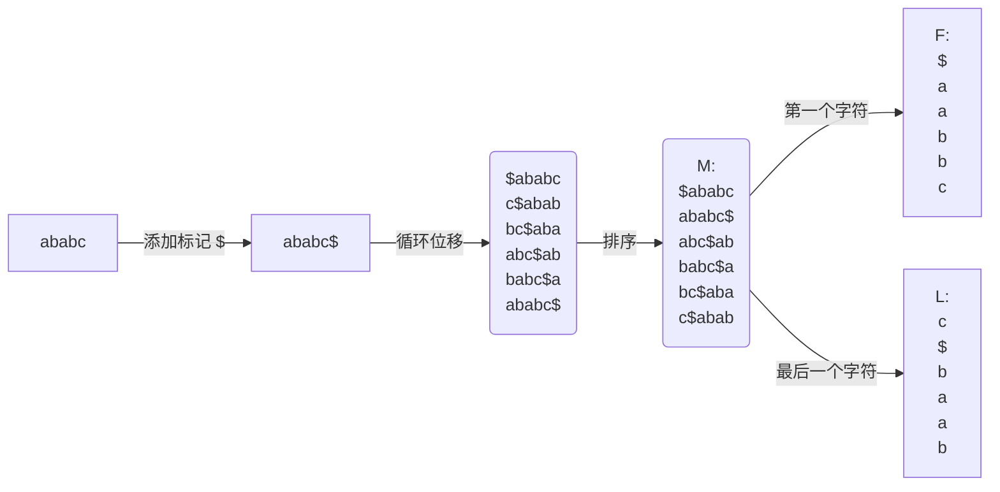
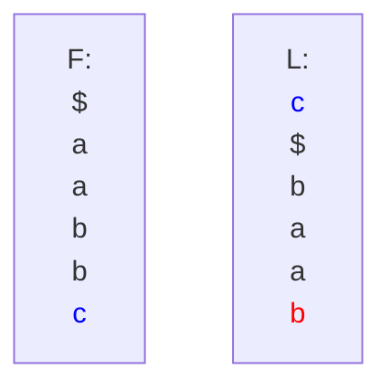
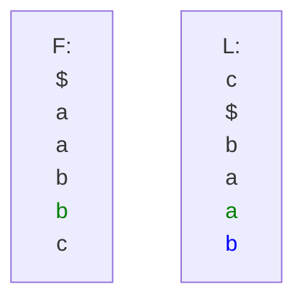
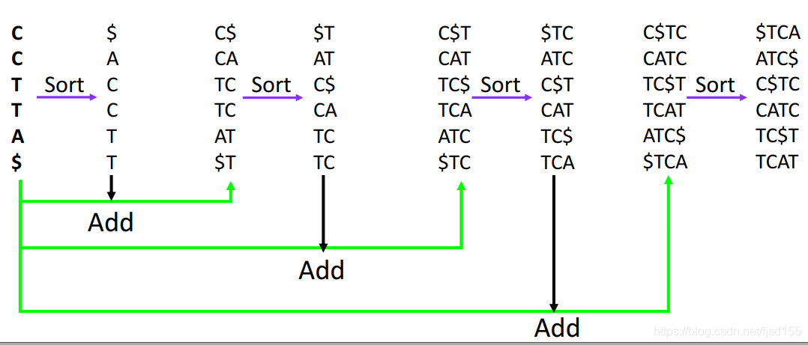
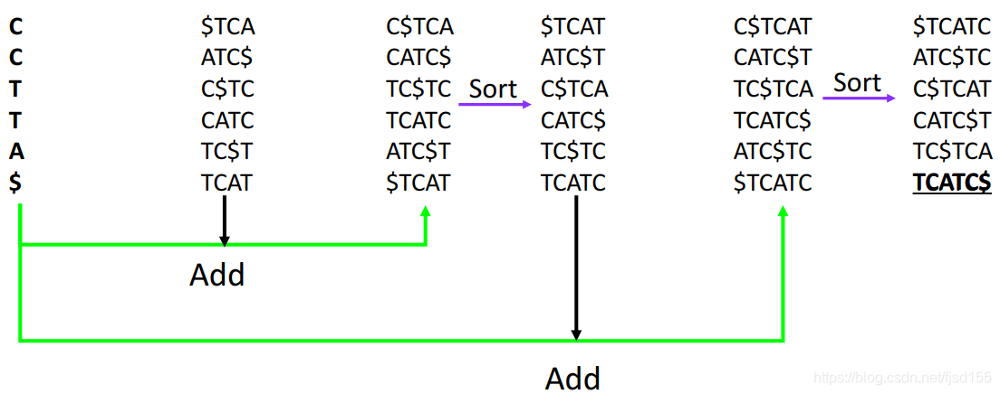
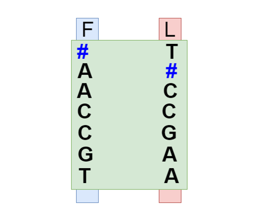

## BWT-Algorithm

### 简介

在初学生物信息时，做二代测序数据的比对时，用 bwa 来做 alignment，当初就已经听过 BWT 算法的名号，但是一直没有深入了解过，最近想要了解一下这个算法的思路和原理。

### 由来

Burrows Wheeler Transform (BWT) 由 Michael Burrows 和 David Wheeler 于 1994 年开发。简单来说，BWT 是一种字符串变换，充当无损压缩的预处理步骤。BWT 具有表现出线性 O(n) 性能和空间复杂度的实现。BWT 最初设计用于使用 bzip2 等技术压缩数据，在生物信息学中有了突出的地位，尤其在短序列比对中。

### 思路和原理

BWT 算法主要用在文本压缩中，即找到重复的模式，进行紧密的编码
BWT 算法可以分为编码和解码两部分

#### 编码

编码的目的就是让字符串中的相似字符可以紧密的排列在一起，这样就可以减少存储空间，提高压缩率。

分为如下几步：

1. 指定输入的字符串为 *s*，并假设其中所有字符都介于 a-z 之间
2. 在 *s* 的末尾添加一个特殊字符，这个特殊字符的 ASCII 码值要比 a-z 中的任何一个都要小，假设这个特殊字符为 $，那么在 s 的末尾添加 `$` 后，得到的新字符串为 *s'*
3. 生成一个长度为 `len(s')` 的字符串数组，数组中的每个元素都是 *s'* 的一个循环移位，即将 *s'* 的最后一个字符移动到最前，得到的新字符串
4. 对数组中的元素进行排序，得到的新数组为 *M*，排序规规为 ASICC 码值从小到大
5. 从 *M* 中取出每个元素的最后一个字符，组成一个新数组为 *F*，即 *F* 为 *M* 中每个元素的最后一个字符组成的数组
6. 同样的，从 *M* 中取出每个元素的第一个字符，组成一个新数组为 *L*，即 *L* 为 *M* 中每个元素的第一个字符组成的数组

上述操作如下图所示：



:::tip

实际上只需要输出 _L_ 即可，因为对 *L* 进行从小到大排序即可得到 _F_

:::

#### 解码

解码的目的就是将编码后的字符串解码成原始字符串，主要分为以下几步：

1. 从 *L* 列从小到大排序得到 *F* 列，不解释
2. 循环解码：按照顺序，根据 *L* 列的字符 L[i]，在 *F* 列中找到与 L[i] 相同的字符 F[j]，同时可以得到 L[j] 并将其记录。
3. 重复步骤 2，直到找到的 F[j] 为标记字符 `$`
4. 按照上述步骤找到的各个 L[j]，得到字符串 *r*

详细步骤如下：

1. *L* 列的第一个字符为 `c`(<highlight color="blue"> 蓝色 </highlight>)，在 *F* 列中找到与 `c` 相同的字符，为 F[6]，同时可以得到 L[6]，即 `b`(<highlight color="red"> 红色 </highlight>):



记录字符串为 `bc`

2. L[6] 的字符 `b`，在 F 列中有两个字符 `b`，这时候的原则为：如果该字符在 F 中出现多次，分别是 F[j],F[j+1],..., 共有 k 个，那么就取 F[j+k-1]，比如这里，有两个，F[4],F[5] 都是 `b`，就选择 F[4+2-1]，即 F[5], 即 `a`(<highlight color="green"> 绿色 </highlight>)



记录字符串为 `abc`

3. 继续按照如上两条规则进行解码记录，得到 `r` 为 `$ababc`，即为原始字符串

:::note

实际上，这样的循环解码，是由编码特性决定的：

1. L 列的第一个元素是原始字符串的最后一个元素
2. 同一行的 F 列和 L 列的元素在原始字符串中是相邻的
3. 同一个字符，在 F 和 L 列中的位置是相同的

:::

### 代码实现

原理懂了，直接干就完了

#### Python 实现

```python title=bwt.py

def all_rotations(s: str) -> list[str]:
    """
    :param s: The string that will be rotated len(s) times.
    :return: A list with the rotations.
    :raises TypeError: If s is not an instance of str.
    """

    # robostness
    if not isinstance(s, str):
        raise TypeError("The parameter s type must be str.")

    rotations = []

    str_len = len(s)


    temp_str = s
    rotations.append(temp_str)
    for i in range(str_len - 1):  ## 生成所有循环位移
        temp_str = temp_str[-1] + temp_str[-str_len:-1]
        rotations.append(temp_str)

    return rotations

def bwt_encode(s: str) -> dict:
    """
    :param s: The string that will be used at bwt algorithm
    :return: the string composed of the last char of each row of the ordered
    rotations and the index of the original string at ordered rotations list
    :raises TypeError: If the s parameter type is not str
    :raises ValueError: If the s parameter is empty
    """

    # robostness
    if not isinstance(s, str):
        raise TypeError("The parameter s type must be str.")
    if not s:
        raise ValueError("The parameter s must not be empty.")

    rotaions = all_rotations(s)
    rotaions.sort()  ## 排序，ASICC 码值从小到大

    bwt_composed_str = "".join([row[-1] for row in rotaions])  ## 取出每个元素的最后一个字符
    original_index = rotaions.index(s)  ## 找到原始字符串的位置

    return {"bwt_string": bwt_composed_str, "original_index": original_index}

def bwt_decode(bwt_string: str, original_index: int) -> str:
    """
    :param bwt_string: The string returned from bwt algorithm execution
    :param idx_original_string: A 0-based index of the string that was used to
    generate bwt_string at ordered rotations list
    :return: The string used to generate bwt_string when bwt was executed
    :raises TypeError: If the bwt_string parameter type is not str
    :raises ValueError: If the bwt_string parameter is empty
    :raises TypeError: If the idx_original_string type is not int or if not
    possible to cast it to int
    :raises ValueError: If the idx_original_string value is lower than 0 or
    greater than len(bwt_string) - 1
    """

    # robostness
    if not isinstance(bwt_string, str):
        raise TypeError("The parameter bwt_string type must be str.")
    if not bwt_string:
        raise ValueError("The parameter bwt_string must not be empty.")
    try:
        idx_original_string = int(idx_original_string)
    except ValueError:
        raise TypeError(
            "The parameter idx_original_string type must be int or passive"
            " of cast to int."
        )
    if idx_original_string < 0:
        raise ValueError("The parameter idx_original_string must not be lower than 0.")
    if idx_original_string >= len(bwt_string):
        raise ValueError(
            "The parameter idx_original_string must be lower than" " len(bwt_string)."
        )


    ordered_rotations = [""] * len(bwt_string)
    for x in range(len(bwt_string)):
        for i in range(len(bwt_string)):
            ordered_rotations[i] = bwt_string[i] + ordered_rotations[i]
        ordered_rotations.sort()
    return ordered_rotations[idx_original_string]

```

解码步骤可以参考下图：



:::tip

这种解码方式中的排序，相当于 [原理](# 解码) 中的寻找相同字符，很好理解

完整代码在 [这里](./assets/bwt.py)

:::

#### rust 实现

```rust title=bwt.rs
不会，先埋坑
```

### 序列比对

那么这种算法是如何应用到序列比对中的呢？拿序列举例：假设我们的参考序列为 `AGCCAT`，有了以上的基础，我们可以获得他的压缩序列：F 列和 L 列，如下图：



两条短 reads，分别为 `AGC` 和 `GAT`

比对和解码一样，都需要从后向前进行：

对 `CAT` 而言：我们现在 F 列找到 `T`，然后 L 列找到 `A`，然后 F 列找到第二个 `A`，对应 L 列的 `C`，就这样我们找到了一条 `T->A->C` 的路径，比对上了！

当然实际情况肯定复杂的多，要考虑错配、GAP、罚分，我肯定是说不出来了，还是得看神中神 [lh3](https://github.com/lh3)
