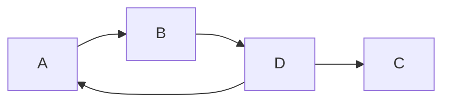
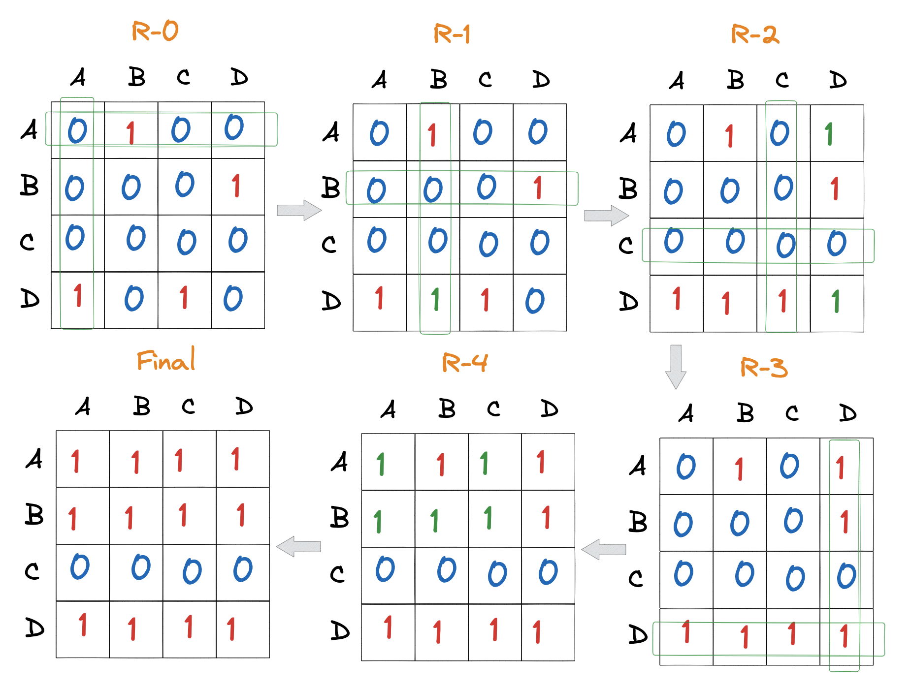

## 定义

一个$n$个顶点的有向图的传递闭包可以定义为一个$n$阶的布尔矩阵$T=\{t_{ij}\}$，其中$t_{ij}=1$当且仅当从顶点$i$到顶点$j$有一条有效的有向路径，否则$t_{ij}=0$。

## 例子

给定如下图的有向图：



那么其邻接矩阵为：

$$
\begin{equation}
A =
\begin{bmatrix}
0 & 1 & 0 & 0 \\
0 & 0 & 0 & 1 \\
0 & 0 & 0 & 0 \\
1 & 0 & 1 & 0
\end{bmatrix}
\end{equation}
$$

:::tip

矩阵方向为 a,b,c,d，从上到下，从左到右

:::

其传递闭包为：

$$ \begin{equation}
R =
\begin{bmatrix}
1 & 1 & 1 & 1 \\
1 & 1 & 1 & 1 \\
0 & 0 & 0 & 0 \\
1 & 1 & 1 & 1
\end{bmatrix}
\end{equation} $$

通俗来讲，邻接矩阵表征的是图中两个顶点之间是否有边，而传递闭包表征的是两个顶点之间的传递关系。

## Floyd-Warshall 算法

该算法用于求解任意两点之间的最短路径，同时也用于计算有向图的传递闭包，本次只记录后者。

时间复杂度为$O(n^3)$, 空间复杂度为$O(n^2)$。

### 算法描述

该算法是一个经典的动态规划算法：

对于求最短路径：求解的问题是任意节点$i$到节点$j$的最短路径。该问题可以分解为如下子问题：我们假设节点$k$是$i$到$j$路径上的中间节点，那么$i$到$j$的路径可以分解为$i$到$k$的路径和$k$到$j$的路径，按此思路遍历所有节点$k$，即可求得$i$到$j$的最短路径。


对于求传递闭包：求解的问题是第一个节点到节点$n$是否有路径。同样的，第$k$个节点的子问题是节点$1$到节点$k$的传递闭包。

### 算法过程

还是以该有向图为例：


过程如图所示：



1. 初始化传递闭包矩阵$R0$为邻接矩阵$A$。
2. 对于第一个节点，添加了第一行第一列，有找到$[d,a]=1$, 即 D 和 A 之间存在路径，也就是说只要 A 能达到的节点，D 也能达到; 又有$[a,b]=1$, 所以$[d,b]=1$, 所以$R1$中更新值 (用绿色表示)
3. 对于第二个节点，添加了第二行第二列，由$[a,b]=1$和$[d,b]=1$,以及$[b,d]=1$, 所以$[a,d]=1$, $[d,d]=1$, $R2$中更新值
4. 对于第三个节点，添加了第三行第三列，但是行方向上的值都为 0, 也就是说这个节点无法到达其他节点，所以$R3$中无需更新值
5. 对于第四个节点，添加了第四行第四列，由$[a,d]=1$  $[b,d]=1$ $[d,d]=1$, 并且列方向上的值都为 1, 也就是说这个节点可以到达其他节点，因此$a$行和$b$行都为 1，$R4$中更新值
6. 最终得到最后的传递闭包矩阵$R$

### 简单实现

```rust
fn transitive_closure(adj: Vec<Vec<i32>>) -> Vec<Vec<i32>> {
    let n = adj.len();
    let mut res = adj.clone();
    for k in 0..n {
        for i in 0..n {
            for j in 0..n {
                res[i][j] = res[i][j] | (res[i][k] & res[k][j]);
            }
        }
    }
    res
}
```

代码实例：https://play.rust-lang.org/?version=stable&mode=debug&edition=2021&gist=65dfec209cc63ebe2e6cb95c45fb205b