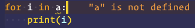
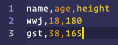
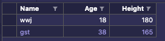
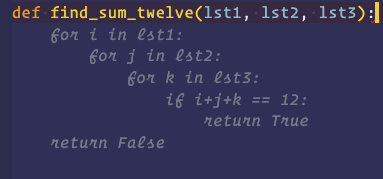
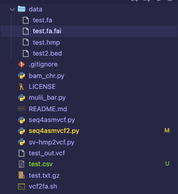
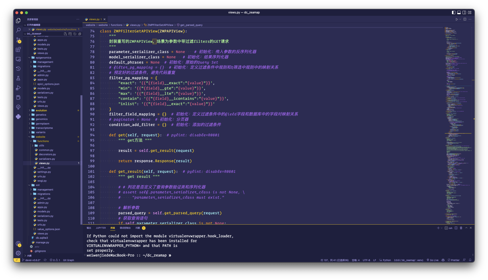

import ReferenceList from "@site/src/components/ReferenceList";
import vscode from "@site/static/img/icon/linux.png";

生物信息吃饭的家伙，离不开 Shell 的命令行操作，其中魅力无穷。其中有一些技巧 / 配置 / 工具，可以让操作更加丝 (zhuang) 滑(bi)。莱次够！

** 排名不分先后，按字母 **

## autoDocstring

在 Python 开发中，给类或者函数写 docstring 注释是一个很好的习惯

autoDocstring 可以根据你的参数和返回值自动生成 docstring 注释模版，往里面填充即可

模版类型可更换。

使用时，输入 `"""`，然后按 <kbd>Tab</kbd> 键，即可生成模版，一气呵成

## Color Highlight

可以在 VSCode 中显示颜色编码所对应的颜色，让人看起来很专业

在进行可视化或者前端开发，比如写 R 和 CSS 时，比较方便

没有用法，只要你写了正确的颜色编码，比如 `#147336` 或者 `rgb(255, 255, 255)`，就会显示颜色

## Dash

Dash 是个桌面 app，用于快速查看、搜索各种编程语言的文档

也有集成在 VSCode 中的插件，鼠标选中想要查阅的内容，按下 <kbd>ctrl</kbd>+<kbd>h</kbd>，即可在 Dash 中打开查看

## Draw.io Integration

Draw.io 是一个在线的绘图工具，可以绘制流程图、思维导图、UML 图等

也可以安装集成在 VSCode 中的插件，用法一样

但我现在用 Excalidraw 更多，各有特色

## Error Lens

可以在多种语言中，突出显示错误的行，并展示错误的消息

即装即用，如图所示，比如在 python 中，我没有定义 `a`：

对于新手，可以帮助快速找到错误原因；对于老手，遇到低级错误，可以快速扇自己几巴掌

## Excel Viewer

可以用来预览 Excel 文件和 CSV 文件，但我很少用 Excel，CSV 看的比较多

安装后，打开 CSV 文件，点击右上角的按钮就行，或者按 <kbd>shit</kbd>+<kbd>command</kbd>+<kbd>v</kbd> 快捷键即可预览

支持排序功能

## Git Graph

便捷、明了地查看 git 记录，用图的方式展示

点击每次提交的节点，可以查看具体的修改内容等

## Github Copilot

** 这位更是重量级 **

Github 推出的一个 AI 助手，以 Github 中所有公开的代码作为训练集，还会考虑上下文的情况，来自动补全你可能想写的代码

我常常就是鼠标一放，等它给提示，然后一看，如果和我想的一样，夸它一句牛逼；如果比我想的高级，那我就学一下高级写法

总之用过都说牛逼，只不过可能马上要收费了；而且对墙内用户来说速度可能不稳定

至于版权争论，那不是我考虑的事，先爽着

来个例子：我只写了模糊的函数名和参数，它就给我补全了，而且这个函数也没这么烂大街 😅：

PS: 我在写这个文档的时候，很多也是它给我补全的，谢谢你

## Live Server

可以快速的开启一个本地服务，用于预览网页，默认端口是 5500

可以修改默认打开的浏览器，支持自动刷新

## Python Environment Manager

管理 Python 的虚拟环境，有点鸡肋，我用命令行就行

## Python Type Hint

在 Python 开发中，写类型标注也是有必要的，这个插件可以帮助你快速生成类型标注

在变量名后面输入 `:`，上下输入选择即可

## Rainbow CSV

因为 CSV 用逗号分隔，如果没有颜色，密密麻麻很伤眼

这个插件可以用颜色区分不同的列，方便查看

## shellman

它可以给你提供实用的 shell 代码片段，我当初就是看这个学 shell 的

它官网自带的 [小册子](https://github.com/yousefvand/shellman-ebook)，也是顶中顶

## Todo Tree

在项目开发中，我习惯用 TODO、FIXME、NOTE 等关键词做 ** 注释 **，标记还需要做的目标、需要修复的问题和注意事项等

这个插件可以给这些关键字高亮显示，并在侧面板中用树状结构展示，用来快速查看和定位

关键词、颜色等这些都可以自己配置

## 其他

其他大部分都是一些语言自带的官方插件，比如 Python 和自带的格式化器，你可以选择不同的格式化方法和配置项。

还有一些是小众支持，比如预览 svg、dotpot、graghviz 等格式，就不一一列举了

## 外观

### 图标 icons

文件图标 icons 我使用的是 [vscode-icons-mac](https://marketplace.visualstudio.com/items?itemName=wayou.vscode-icons-mac)

### 主题

我使用的是 [Shades of Puple](https://marketplace.visualstudio.com/items?itemName=ahmadawais.shades-of-purple)

整体效果我挺喜欢，黑暗 / 明亮模式我都用它

不过这东西见仁见智吧，我之前还用一个贼骚的赛伯朋克，一闪一闪的霓虹，挺好看的，就是废眼睛

### 字体

下载安装了 `Operator Mono`，不解释，个人喜好。

** 分享就到这吧，等找到啥好玩有用的再更新！**

## 参考资料

<ReferenceList
    data={[
        {
            title: "VSCode 插件市场 ",
            link: "https://marketplace.visualstudio.com",
            src: vscode,
        },
    ]}
/>
