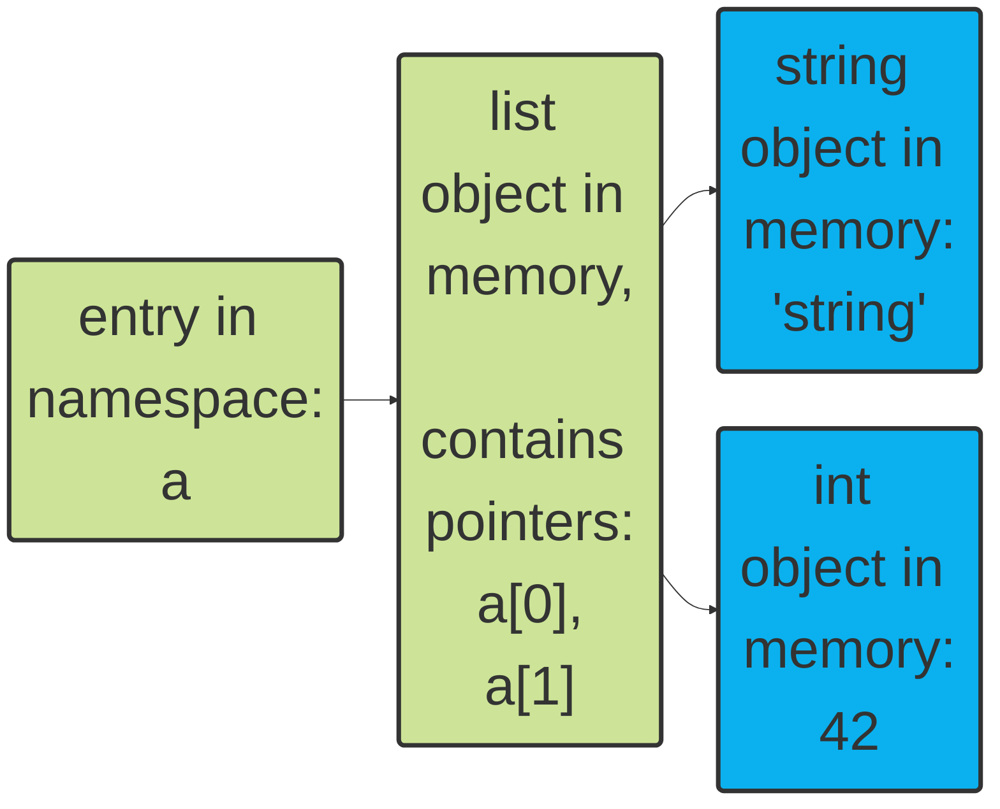
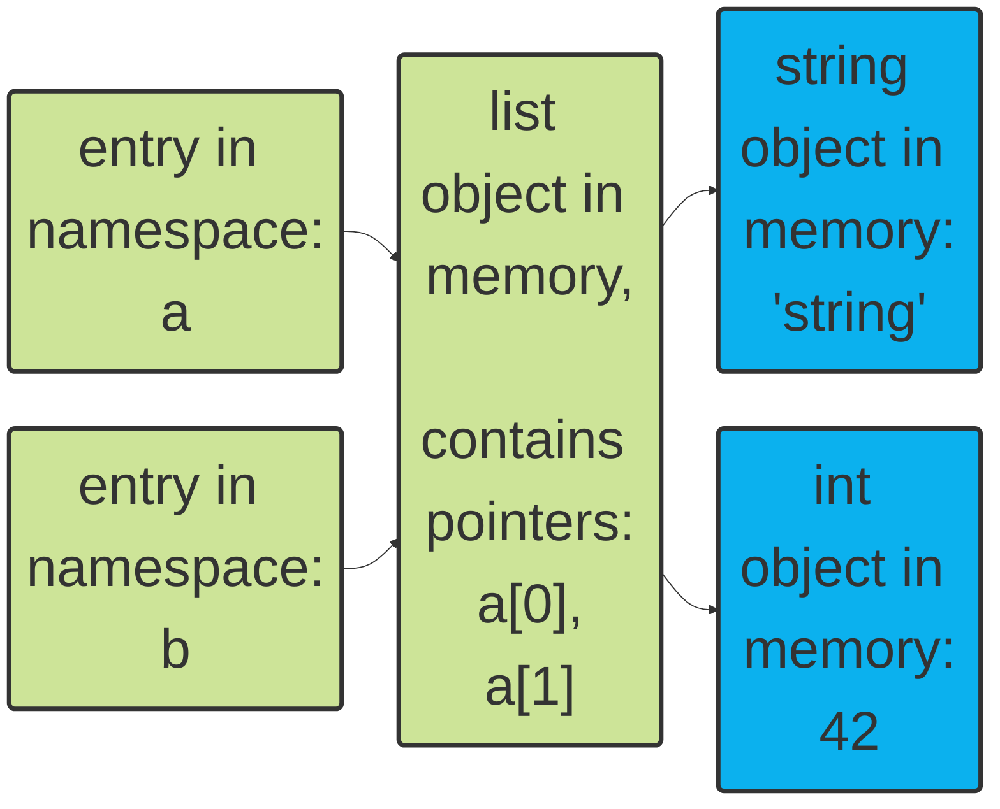
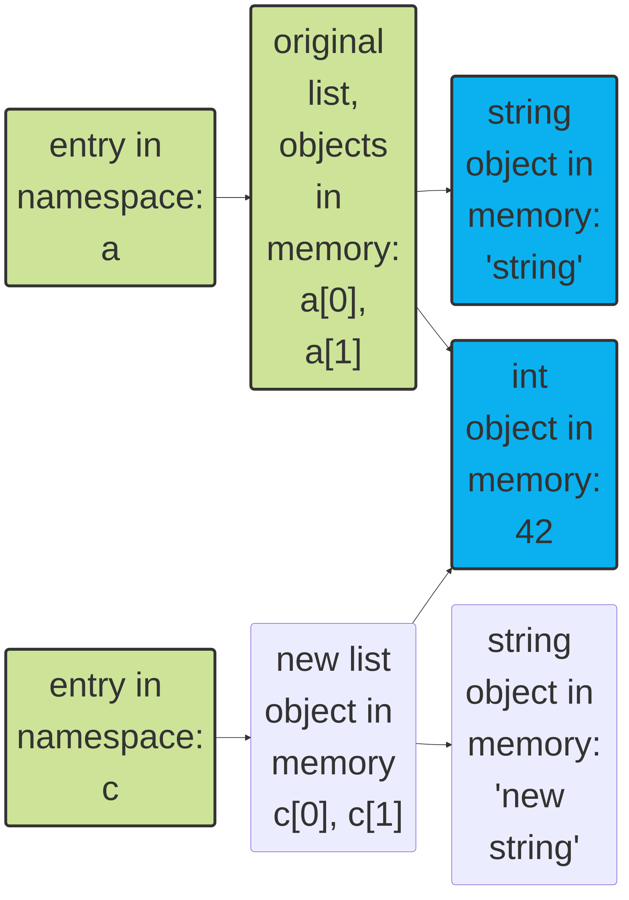
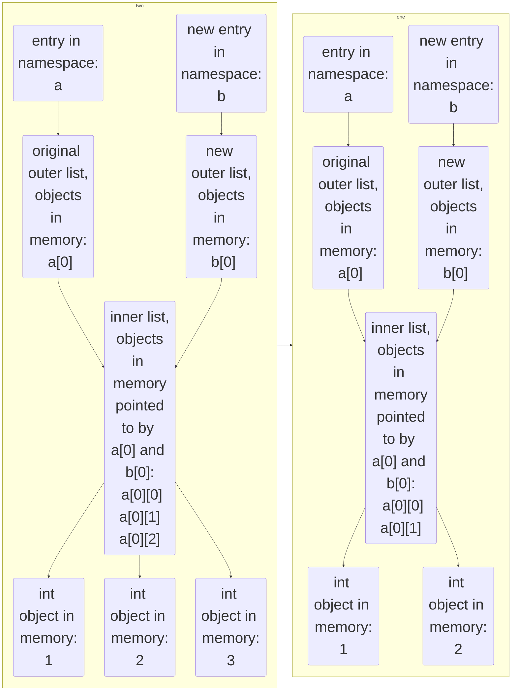

## 背景

在其他语言中，比如 C 语言，经常能听到内存管理的问题，比如内存泄漏，内存溢出等等。而在 Python 中，这些问题很少在一些入门初级教程中提到，甚至有些教程甚至不提及这些问题。但是，这些问题在 Python 中也是存在的，只是 Python 中的内存管理机制使得这些问题很少被摆到台面上让用户操作。在这里我以个人粗浅的理解来谈谈 Python 中的内存管理。

Python 基本不让用户直接管理内存，比如预先分配内存，或者用完之后就释放，既然无需我们手动做，那么这些事情是如何发生的呢，其实对于使用 python 来进行一些简单的数据处理，我们可以并不在乎，但是，知道还是好的。

## 指针？在哪？

<highlight color="#25c2a0">pointers</highlight>，指针，是在C/C++里的重要概念。

:::info

指针也就是内存地址，指针变量是用来存放内存地址的变量，指针描述了数据在内存中的位置，标示了一个占据存储空间的实体，在这一段空间起始位置的相对距离值。在 C/C++语言中，指针一般被认为是指针变量，指针变量的内容存储的是其指向的对象的首地址，指向的对象可以是变量（指针变量也是变量），数组，函数等占据存储空间的实体。

:::

在 python 中，也有一个类似的概念叫做`namespace`，命名空间，可以理解为所有变量、关键字、函数的集合，例如所有内置函数`print()`、`min()`，关键字`True`、`None`这些始终在命名空间中。

当我们创建了一个新变量，如`wwj_string = "Fuck World!"`时，这个变量的名称会被添加到所在范围（作用域）的命名空间中，在本文中为了简单，假设都发生在全局命名空间中（有关作用域介绍，见下方 [tips](#作用域-variable-scope)）。

在该例子中，**wwj_string**就是指针，内存中的对象是一个值为**"FUck World!"**的字符串。

:::caution 注意 ⚠️

上文提到的指针，并不是 C/C++中的指针，更类似于引用，其中细节见[这里 👉](https://realpython.com/pointers-in-python/)

:::
当我们创建一个 list: `my_lst = ['string, 42]`



如上图所示，**my_lst**是一个指针，指向一个 list 对象，该对象包含两个指针，分别指向两个对象，一个是字符串对象，一个是 int 对象。

### 指针混淆（alias）

有时候两个指针指向同一个对象，这时候我们会说这两个指针是混淆的，例如：

```python showLineNumbers {5}
a = ["string", 42]
>>>a
['string', 42]

b = a
b[0] = "new string"
>>>b
['new string', 42]
>>>a
['new string', 42]
```

在这个例子中，我们定义了 list a，然后将 a 赋值给 b，这时候 a 和 b 指向同一个对象，当我们修改 b 的第一个元素时，a 也会被修改，因为 a 和 b 指向同一个对象。

实际上，我们在第 5 行，并没有定义创建一个新的 list 对象，而是创建了一个指针，指向了 a 指向的对象，这时候 a 和 b 指向同一个对象。



所以当我们改变 b[0]时，a[0]也会被改变。

### 浅拷贝与深拷贝 copy

那么若我们想要在不影响原始对象的条件下创建一个新的对象，我们可以用`copy`方法，

```python showLineNumbers
c = a.copy()
c[0] = "new string"
>>>c
['new string', 42]
>>>a
['string', 42]
```



但是，如果我们 list 中的元素也是个 list 呢？

```python showLineNumbers
a = [[1, 2, 3]]
>>>a
[[1, 2, 3]]
b = a.copy()
b[1][0] = 42
>>>b
[[42, 2, 3]]
>>>a
[[42, 2, 3]]
```

这就和上一个例子不一样，但是我们仔细把逻辑理清楚：



相当于说，我们的`copy`方法，只拷贝了一层，而没有拷贝更深层的对象。这就是所谓的浅拷贝`shallow copy`
对应的，还有个方法是深拷贝`deep copy`，它会递归地创建它遇到的每个对象的船新版本，有了上述例子，这个就很好理解了。

```python showLineNumbers
from copy import deepcopy
c = deepcopy(a)
c[0][0] = 42
>>>c
[[42, 2, 3]]
>>>a
[[1, 2, 3]]
```

:::info

在上述例子中，我们 a，c 两个 list 中的 a[0][1],a[0][2]和 c[0][1],c[0][2]都是同一个对象，因为 python 存在一些内存优化机制，防止创建不需要的、相同的不可变对象，但是如果该对象为用户定义的类时，深拷贝会创建对象的新实例。

:::

:::tip

### 作用域 Variable Scope

python 中会存在多个同名的实例，但是只要他们在不同的作用域中，他们就是单独的，不会相互干扰。
但是存在的问题就是，加入在代码中引用变量`w`，而且你写了好多个变量都叫`w`，python 怎么知道你想用的是哪个`w`呢？
这里就对应了作用域这个概念，解释器会根据`w`被定义时的位置，以及你在代码中引用`w`的位置，来决定，具体来说，是按照如下的顺序：

1. Local：你在函数里面引用 W，就优先会在函数内部找
2. Enclosing：如果 local 里找不到，就去其他封闭函数里找
3. Global：如果前两个找不到，就去全局作用域里找
4. Built-in：最后，去内置作用域找

以上被称为<highlight color="#25c2a0">LGEB 规则</highlight>，意味着如上的搜索顺序，如果都找不到，就抛出`NameError Exception`。


来个简单例子就能理解：

```python variable-scope-1.py showLineNumbers {1}
x= 'global'

def f():

    def g():
        print(x)

    g()

f()
>>>golbal
```

```python variable-scope-2.py showLineNumbers {4}
x= 'global'

def f():
    x = 'enclosing'

    def g():
        print(x)

    g()

f()
>>>enclosing
```

```python variable-scope-3.py showLineNumbers {7}
x= 'global'

def f():
    x = 'enclosing'

    def g():
        x = 'local'
        print(x)

    g()

f()
>>>local
```

:::

## 不可变对象

在大部分的 python 基础教程中，都说列表是可变的，元组是不可变的（我们暂且先认同这个说法 😊）来看这个例子：

```python immutable-1.py showLineNumbers
a= (43, 'hello')
a[0] = 42
Traceback (most recent call last):
  File "<stdin>", line 1, in <module>
TypeError: 'tuple' object does not support item assignment
```

很好理解，因为元组是不可变对象。但是，如果其中的元素是可变对象呢？

```python immutable-2.py showLineNumbers
a = ([1, 2], 'hello')
a[0].append(3)
>>>a
([1, 2, 3], 'hello')
```

事实证明是可以的，因为我们并没有改变 a[0]，这是个指针，我们更改的是指针对应的对象的值，并没有违背元组不可变的原则。

### +=操作符

实际上，除了`append`方法，我们还可以用`+=`操作符来对一个列表进行添加操作，简单的例子如下：

```python immutable-3.py showLineNumbers
my_lst = [1, 2, 3]
my_lst += [4, 5]
>>>my_lst
[1, 2, 3, 4, 5]
```

这里在执行`+=`操作时，实际上存在两个步骤：

1. 创建对象，对于 list 这种可变对象，就在原对象上改变，对于不可变对象，比如字符串，会创建一个新的对象，这个创建对象的操作，对应着`+`操作符。
2. 赋值，重新分配指针，指向所需的对象，对应着`=`操作符。

这就意味着，在可变对象上，执行该操作符是比较冗余的，如以下例子：

```python
my_string = 'hello'
my_string += ' world'
>>>my_string
'hello world'
```

字符串是不可变的，所以`=`操作符会创建一个全新的字符串对象，然后将`my_string`指向它。
那么如果结合`+=`操作符和元组中的列表元素呢？试一下：

```python immutable-4.py showLineNumbers
a = ([1, 2], 'hello')
a[0] += [3]
Traceback (most recent call last):
  File "<stdin>", line 1, in <module>
TypeError: 'tuple' object does not support item assignment
>>>a
([1, 2, 3], 'hello')
```

**ridiculous!?**，明明报错，但是却实现了？
仔细分析，对照上文说过的两步操作，可以发现，错误发生在第二步，也就是我们不能直接分配给 a[0]，因为它是元组的元素。但是为什么最终实现了呢？因为我们的第一步是没毛病的，我们在原对象上（list）进行了改变，这是我们预期的结果。所以第一步是 OK 的，但是执行第二步的时候，把指针分配给 a[0]的时候，就报错了。所以我们分别得到了：**预期的变化**和**报错**。

## 什么是`=`？

上文提到了[深拷贝和浅拷贝](#浅拷贝与深拷贝-copy)，那我们证明确实，深拷贝之后的对象，是不同的对象，而不是一个新指针呢？也就是说，我吗如何知道两个对象是内存中实际上是同一个对象？在一些入门教程中，有两个方法：`is`和`==`

### is 方法

#### 对象的 id

python 中有一个 built-in 的方法叫`id`，可以返回某个对象的内存。但是内存的分配，却要看 python 的解释器的实现，比如说，默认的 CPython，会使用对象的内存地址作为返回。
但是其他的编译器，比如 Skulpt，是一个 Python-JavaScript 编译器，用于在浏览器中运行 Python，但是这种情况下，就不能提哦为每个对象提供稳定公开的对象地址作为 id。

使用很简单，如下，我们创建一个 list`a`，并赋值给`b`，创建了新的指针，检查两者的 id，会发现是相同的。当我们用浅拷贝方法创建`c`
，则和`a`有不同的 id

```python showLineNumbers
a = ['hello','world']
b = a
>>>id(a)
4498576064
>>>id(b)
4498576064

c = a.copy()
>>>id(c)
4499390144
```

#### is 方法的实现

在基本了解 python 的`id`方法之后，可以发现 is 方法的实现很简单，就是比较两者的 id。

### `==`方法

先用上文的例子来干一下，看看该方法的返回和`is`方法的返回有何不同。

```python showLineNumbers
a = ['hello','world']
b = a
c = a.copy()

>>> a == b
True
>>> a is b
True

>>> a == c
True
>>> a is c
False
```

这个例子中就很好看出，这两个方法是不一样的，实际上 a 和 c 的内存地址不相同，但是它们的值是相同的，所以`==`返回了`True`，而`is`返回了`False`。
当我们使用`==`时，调用的是一个叫`__eq__`的魔法方法(magic method)，python 中所以都是对象，那么在定义对象的类的时候，就会
定义好两个实例的`__eq__`方法，当然了，也可以重写`__eq__`方法，写成用`is`判断。

## 所谓生命周期

一旦当我们创建了一个对象之后，在不需要它之后，我们该如何结束，如何将其从内存中释放出来？
首先我们来看另一个魔法方法：

### `__del__`方法

该方法是在对象被销毁之前调用的，但并非执行从内存中移除该对象的工作，我们可以在这个方法中做一些清理工作，比如说关闭文件，关闭数据库连接等等，举个简单例子：

```python showLineNumbers
class MyClass:
  def __init__(self, name):
    self.name = name

  def __del__(self):
    print(f"Deleting {self.name}!")
```

我们定义了一个类，当这个类的某个实例被销毁之前，会打印该实例的`name`，这能让我们知道，这个实例是否被销毁了。（但这并不总是正确的）
那么，CPython 是如何判断一个对象是否应该被销毁呢？两种方式：引用计数和垃圾回收。

### 引用计数 Reference counting

当我们有一个指向某个实例的指针，那么这个实例就有了一个**引用**，对于该实例，CPython 会跟踪有多少引用指向它，如果计数器为 0，那么这个实例就可以被销毁了。在创建上面那个类的前提下，举如下例子：

```python showLineNumbers
>>>wwj = MyClass('wwj')
>>>del wwj
Deleting wwj!
```
