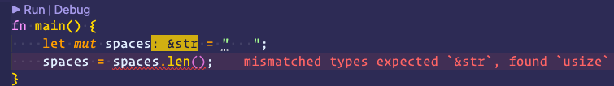

import ReferenceList from "@site/src/components/ReferenceList";
import rust from "@site/static/img/icon/rust.png";
import ide from "@site/static/img/icon/ide.png";
import Tabs from "@theme/Tabs";
import TabItem from "@theme/TabItem";


## 变量绑定与解构

啥叫变量就不谈了，都学 rust 了。

### 可变还是不可变？

在编程语言设计中，若支持声明可变的变量：灵活性。若只支持声明不可变的变量：安全性。那么 Rust 则说：“我全都要！”

### 变量命名

大部分语言的命名规范都类似，这里遵循[Rust 命名规范](https://course.rs/practice/naming.html)。

:::tip

Rust 中也存在关键字`keywords`，需要避免其作为变或函数的名称。

<details>
  <summary>目前正在使用的关键字</summary>
  <ul>
    <li>
      <code>as</code> - 强制类型转换，或
      <code>use</code> 和 <code>extern crate</code>
      包和模块引入语句中的重命名
    </li>
    <li>
      <code>break</code> - 立刻退出循环
    </li>
    <li>
      <code>const</code> - 定义常量或原生常量指针（constant raw pointer）
    </li>
    <li>
      <code>continue</code> - 继续进入下一次循环迭代
    </li>
    <li>
      <code>crate</code> - 链接外部包
    </li>
    <li>
      <code>dyn</code> - 动态分发特征对象
    </li>
    <li>
      <code>else</code> - 作为 <code>if</code> 和 <code>if let</code>{" "}
      控制流结构的 fallback
    </li>
    <li>
      <code>enum</code> - 定义一个枚举类型
    </li>
    <li>
      <code>extern</code> -
      链接一个外部包,或者一个宏变量(该变量定义在另外一个包中)
    </li>
    <li>
      <code>false</code> - 布尔值 <code>false</code>
    </li>
    <li>
      <code>fn</code> - 定义一个函数或 <strong>函数指针类型</strong> (
      <em>function pointer type</em>)
    </li>
    <li>
      <code>for</code> - 遍历一个迭代器或实现一个 trait
      或者指定一个更高级的生命周期
    </li>
    <li>
      <code>if</code> - 基于条件表达式的结果来执行相应的分支
    </li>
    <li>
      <code>impl</code> - 为结构体或者特征实现具体功能
    </li>
    <li>
      <code>in</code> - <code>for</code> 循环语法的一部分
    </li>
    <li>
      <code>let</code> - 绑定一个变量
    </li>
    <li>
      <code>loop</code> - 无条件循环
    </li>
    <li>
      <code>match</code> - 模式匹配
    </li>
    <li>
      <code>mod</code> - 定义一个模块
    </li>
    <li>
      <code>move</code> - 使闭包获取其所捕获项的所有权
    </li>
    <li>
      <code>mut</code> - 在引用、裸指针或模式绑定中使用，表明变量是可变的
    </li>
    <li>
      <code>pub</code> - 表示结构体字段、
      <code>impl</code> 块或模块的公共可见性
    </li>
    <li>
      <code>ref</code> - 通过引用绑定
    </li>
    <li>
      <code>return</code> - 从函数中返回
    </li>
    <li>
      <code>Self</code> - 实现特征类型的类型别名
    </li>
    <li>
      <code>self</code> - 表示方法本身或当前模块
    </li>
    <li>
      <code>static</code> - 表示全局变量或在整个程序执行期间保持其生命周期
    </li>
    <li>
      <code>struct</code> - 定义一个结构体
    </li>
    <li>
      <code>super</code> - 表示当前模块的父模块
    </li>
    <li>
      <code>trait</code> - 定义一个特征
    </li>
    <li>
      <code>true</code> - 布尔值 <code>true</code>
    </li>
    <li>
      <code>type</code> - 定义一个类型别名或关联类型
    </li>
    <li>
      <code>unsafe</code> - 表示不安全的代码、函数、特征或实现
    </li>
    <li>
      <code>use</code> - 在当前代码范围内(模块或者花括号对)引入外部的包、模块等
    </li>
    <li>
      <code>where</code> - 表示一个约束类型的从句
    </li>
    <li>
      <code>while</code> - 基于一个表达式的结果判断是否继续循环
    </li>
  </ul>
</details>

<details>
  <summary>保留做将来使用的关键字</summary>
  <ul>
    <li>
      <code>abstract</code>
    </li>
    <li>
      <code>async</code>
    </li>
    <li>
      <code>await</code>
    </li>
    <li>
      <code>become</code>
    </li>
    <li>
      <code>box</code>
    </li>
    <li>
      <code>do</code>
    </li>
    <li>
      <code>final</code>
    </li>
    <li>
      <code>macro</code>
    </li>
    <li>
      <code>override</code>
    </li>
    <li>
      <code>priv</code>
    </li>
    <li>
      <code>try</code>
    </li>
    <li>
      <code>typeof</code>
    </li>
    <li>
      <code>unsized</code>
    </li>
    <li>
      <code>virtual</code>
    </li>
    <li>
      <code>yield</code>
    </li>
  </ul>
</details>
:::

### 变量绑定

在其他语言中，有很多赋值的操作，比如：

<Tabs>
  <TabItem value="python" label="Python" default>
    <code>a = 3</code>
  </TabItem>
  <TabItem value="js" label="JavaScript">
    <code>var a = "hello"</code>
  </TabItem>
  <TabItem value="shell" label="Shell">
    <code>a="linux"</code>
  </TabItem>
</Tabs>

虽然形式多变，但就是把等式右边的值赋给左边的变量。在 Rust 中，我们这样写：

```rust
let a = "hello";
```

这个过程叫做变量的绑定。
这有啥区别？这就设计到 Rust 最核心的原则--所有权，即任何内存对象都有一个所有者，并完全属于该所有者，绑定就是把这个对象绑定给一个变量。
具体细节，以及为何要有所有权，后续再讲。

### 变量可变性

Rust 的变量在默认情况下是不可变的，这让我们的代码更安全，性能更好。也可以通过 `mut` 关键字来声明变量可变，提供一些灵活性。
当然不可变，顾名思义，一旦为一个变量绑定了值，就不能再修改改变量。就拿 cargo 新建的项目举例。
编辑 `src/main.rs`

```rust
fn main() {
    let x = 5;
    println!("The value of x is: {}", x);
    x = 6;
    println!("The value of x is: {}", x);
}

```

用 cargo 编译运行，直接报错：

```shell
$ cargo run
   Compiling bull_shit v0.1.0 (/Users/wjwei/code/learn-rust/bull_shit)
error[E0384]: cannot assign twice to immutable variable `x`
 --> src/main.rs:4:5
  |
2 |     let x = 5;
  |         -
  |         |
  |         first assignment to `x`
  |         help: consider making this binding mutable: `mut x`
3 |     println!("The value of x is: {}", x);
4 |     x = 6;
  |     ^^^^^ cannot assign twice to immutable variable

For more information about this error, try `rustc --explain E0384`.
error: could not compile `bull_shit` due to previous error
```

具体原因编译器以及说的很直白了，`cannot assign twice to immutable variable`，无法对不可变的变量重复赋值。
这种规则使代码变得清晰，只有你让他可变时，该变量才可以改变。
但是可变性也同样重要，如果每次改变，都要产生一个新的变量，那么内存的成本会变大。
可变也很简单，只需要在变量前加上 `mut` 关键字即可，这种显示的声明，也让代码的可读性更好。

```rust
fn main() {
    let mut x = 5;
    println!("The value of x is: {}", x);
    x = 6;
    println!("The value of x is: {}", x);
}

```

这样便可以顺利编译运行：

```shell
$ cargo run
   Compiling bull_shit v0.1.0 (/Users/wjwei/code/learn-rust/bull_shit)
    Finished dev [unoptimized + debuginfo] target(s) in 0.96s
     Running `target/debug/bull_shit`
The value of x is: 5
The value of x is: 6
```

### 可变还是不可变？

这还是取决你的使用场景，不可变带来安全性，但是丧失了灵活性和性能（如果你要改变，就要重新创建一个新的变量，这里涉及到内存对象的再分配）。而可变最大的好处就是使用上的灵活性和性能上的提升。

具体例子的话，等我再学学后面的，现在太菜了，举例子就是扯淡。

### 忽略变量

如果创建了一个变量，但是暂时不想使用，可以使用 `_` 来忽略该变量，这样编译器就不会报错了。

### 变量解构

`let`表达式既可以绑定变量，也可以从一个复杂的变量中，匹配出该变量的部分内容，称之为解构：

```rust
fn main() {
    let (a, mut b): (bool,bool) = (true, false);
    // a = true,不可变; b = false，可变
    println!("a = {:?}, b = {:?}", a, b);

    b = true;
    assert_eq!(a, b);
}
```

### 变量与常量

`constant`，常量，是一个绑定到常量名切不允许更改的值，和变量不同的是：

- 常量不允许使用 `mut` 关键字，因为它自始至终不可变，在编译完成后，就已经确定了该值
- 常量使用 `const` 关键字，而不是 `let` ，并且值的类型**必须**标注。
  例如：

```rust
const MAX_POINTS: u32 = 100_000;
```

常量的命名约定是大写字母，并用下划线分割单词，并对数字插入下划线提高可读性。

::: tip

关于数字的下划线，尝试不同的插入位置，我发现并没有区别，只不过欧美是使用千分位，习惯说 6k，8k。

:::

常量在任何作用域内被声明，在程序运行的整个过程中有效。

### 变量遮蔽

Rust 允许声明相同的变量名，后声明的变量会遮蔽之前声明的，例如：

```rust
fn main() {
    let x = 5;
    // 在main函数的作用域内对之前的x进行遮蔽
    let x = x + 1;

    {
        // 在当前的花括号作用域内，对之前的x进行遮蔽
        let x = x * 2;
        println!("The value of x in the inner scope is: {}", x);
    }

    println!("The value of x is: {}", x);
}
```

首先，数值 5 被绑定到`x`，之后取该值加 1，重新绑定。在第二个花括号内的绑定，同样遮蔽了之前的`x`，取值乘 2，重新绑定。
所有最终的打印结果分别为 6，12。其实也是比较好理解的。

看似是变量`x`的值被修改了两次，但是这和`mut`变量的使用是不一样的：第二个`let`生成了完全不同的新变量，只是两个变量恰好名称相同，涉及一次内存对象的再分配。但是`mut`变量，可以修改同一内存地址上的值，不设计内存对象的再分配。

但是变量遮蔽可以让你在**无需使用之前变量的情况下**，重复地使用变量名字。
例如一个程序要统计空格字符串的空格数量：

```rust
fn main() {
    // 字符串类型
    let spaces = "   ";
    // usize数值类型
    let spaces = spaces.len();
    println!("spaces: {}", spaces);
}
```

如果用`mut`变量呢？

```rust
fn main() {
    let mut spaces = "   ";
    spaces = spaces.len();
}
```

编辑器 VSCode 红色波浪线，提示`expected &str, found usize`，因为`spaces`的类型是`&str`，而`spaces.len()`的类型是`usize`，这是不允许的。


## 变量基本类型

与 Python、JS 等动态语言不同，Rust 是一门静态类型语言，在编译时就要知道所有变量的类型。在某些情况下，我们需要给变量一个显示的类型标注，一般写在变量名后加个冒号，再加上类型：

```rust
let guess: u32 = 666;
```

Rust 中存在如下基本类型：

- 数值类型
- 字符串
- 布尔类型
- 字符类型
- 单元类型

### 数值类型

数值类型包括整数与浮点数。

#### 整数类型

数学上，整数是没有小数部分的数字。整数类型有两种：有符号与无符号。
Rust 内置如下整数类型：

| 长度       | 有符号类型 | 无符号类型 |
| ---------- | ---------- | ---------- |
| 8          | `i8`       | `u8`       |
| 16         | `i16`      | `u16`      |
| 32         | `i32`      | `u32`      |
| 64         | `i64`      | `u64`      |
| 128        | `i128`     | `u128`     |
| 视架构而定 | `isize`    | `usize`    |

**无符号**数只能取正数，**有符号**数可正可负，并以**补码**形式存储。

:::tip

计算机中，有符号数存在三种表示方法，分别是**原码**、**反码**、**补码**。

### 机器数与真值

首先了解一下机器数与真值的概念。我们以 8bit 计算机为例。

#### 1、机器数

一个数在计算机中的二进制表示形式，即为机器数，其中最高位为符号位，0 表示正数，1 表示负数。
比如十进制数+3，二进制位表示为`0000 0011`，则其机器数为`0000 0011`。
如果是-3，则最高位变 1，机器数为`1000 0011`。

#### 2、真值

因为最高位是符号位，所有机器数的形式值不等于正式的数值。比如上面提到-3 的机器数为`1000 0011`，其真实数值是-3，而不是形式值`131`。
所以为了区别起见，带符号位的机器数对应的真实数值称为真值，即考虑首位符号位。

### 原码、反码、补码的基础概念和计算方法

原码, 反码, 补码是机器存储一个具体数字的编码方式。

#### 原码

原码就是符号位加上真值的绝对值，首位表示符号，其余位表示值：

> [+1]<sub><sub>原</sub></sub> = 0000 0001

> [-1]<sub><sub>原</sub></sub> = 1000 0001

所以 8 位二进制数的范围是-127~+127。

#### 反码

正数的反码是其本身，负数的反码是在原码基础上，符号位不变，其余位取反：

> [+1] = [00000001]<sub>原</sub> = [00000001]<sub>反</sub>

> [-1] = [10000001]<sub>原</sub> = [11111110]<sub>反</sub>

#### 补码

正数的补码是其本身，负数的补码是在其反码的基础上+1：

> [+1] = [00000001]<sub>原</sub> = [00000001]<sub>反</sub> = [00000001]<sub>补</sub>

> [-1] = [10000001]<sub>原</sub> = [11111110]<sub>反</sub> = [11111111]<sub>补</sub>

### 三种方式的区别

三种方式截然不同，原码是人脑最能直接识别的。但是计算机在进行运算操作时，辨别符号位让基础电路设计变复杂，所以需要将符号位**参与**运算。
在运算法则中，减去一个正数等于加上一个负数，所以计算机中可以只有加法而没有减法，大大简化设计。
来看三种方式的减法运算：

1. 原码

   > 1 - 1 = 1 + (-1) = [00000001]<sub>原</sub> + [10000001]<sub>原</sub> = [10000010]<sub>原</sub> = -2

   这明显就错了

2. 反码

   > 1 - 1 = 1 + (-1) = [00000001]<sub>反</sub> + [11111110]<sub>反</sub> = [11111111]<sub>反</sub> = [10000000]<sub>原</sub> = -0

   虽然值是正确的，但是 0 这个特殊数值，带符号是没有意义的，也就是说会有[00000000]原和[10000000]原两种编码表示 0。

3. 补码

   > 1 - 1 = 1 + (-1) = [00000001]<sub>补</sub> + [11111111]<sub>补</sub> = [00000000]<sub>补</sub> = [00000000]<sub>原</sub> = 0

   发现用补码，可以修复 0 的符号问题，还可以多表示一个最小值，即-128。

:::

其中`usize`和`isize`取决于允许程序运行的计算机 CPU 位数。
Rust 默认使用`i32`。`isize` 和 `usize` 的主要应用场景是用作集合的索引。

#### 整型溢出

假设有一个 `u8` ，它可以存放从 0 到 255 的值。那么当你将其修改为范围之外的值，比如 256，则会发生整型溢出。关于这一行为 Rust 有一些有趣的规则：当在 debug 模式编译时，Rust 会检查整型溢出，若存在这些问题，则使程序在编译时 panic(崩溃,Rust 使用这个术语来表明程序因错误而退出)。

在当使用 --release 参数进行 release 模式构建时，Rust 不检测溢出。相反，当检测到整型溢出时，Rust 会按照补码循环溢出的规则处理。简而言之，大于该类型最大值的数值会被补码转换成该类型能够支持的对应数字的最小值。比如在 u8 的情况下，256 变成 0，257 变成 1，依此类推。程序不会 panic，但是该变量的值可能不是你期望的值。依赖这种默认行为的代码都应该被认为是错误的代码。

要显式处理可能的溢出，可以使用标准库针对原始数字类型提供的这些方法：

- 使用 `wrapping_*` 方法在所有模式下都按照补码循环溢出规则处理，例如 wrapping_add
- 如果使用` checked_*` 方法时发生溢出，则返回 None 值
- 使用 `overflowing_*` 方法返回该值和一个指示是否存在溢出的布尔值
- 使用 `saturating_*` 方法使值达到最小值或最大值

#### 浮点类型

浮点类型数字带有小数点，在 Rust 中有两种基本类型：`f32`和`f64`。`f64`是默认类型，因为在现代 CPU 上速度和 `f32 ` 几乎相同，但是精度更高。

:::danger 浮点数陷阱

由于底层格式的特殊性，需要避免在浮点数上使用相等运算符。例如，`0.1 + 0.2` 的结果并不是 `0.3`。

:::

#### NaN

对于数学上未定义的结果，比如 0 除以 0，Rust 使用 `NaN`（Not a Number）值。可以使用 `f32::NAN` 或 `f64::NAN` 来创建一个 `NaN` 值。`NaN` 值不等于任何值，包括它自己。`NaN` 值也不小于、不大于或等于任何值。
使用`is_nan()`等方法，判断一个变量是否是`NaN`。

```rust
fn main() {
    let x = (-42.0_f32).sqrt();
    if x.is_nan() {
        println!("未定义的数学行为")
    }
}

```

#### 数字运算

Rust 支持数字类型的基本数学运算：

- 加法：`+`
- 减法：`-`
- 乘法：`*`
- 除法：`/`
- 取余：`%`

支持位运算：

- 按位与：`&`：相同位置均为 1 时则为 1，否则为 0
- 按位或：`|`：相同位置有一个为 1 时则为 1，否则为 0
- 按位异或：`^`：相同位置不同时则为 1，否则为 0
- 按位取反：`!`：相同位置取反
- 左移：`<<`：将二进制数向左移动指定位数，右位补 0
- 右移：`>>`：将二进制数向右移动指定位数，左位补 0

#### 数字范围

Rust 使用简洁的方式生成连续的数值，类似 Python 的 range 函数。

```rust
fn main() {
    for i in 1..5 {
        println!("{}", i);
    }
}
```

输出 1，2，3，4

```rust
fn main() {
    for i in 1..=5 {
        println!("{}", i);
    }
}
```

输出 1，2，3，4，5

也允许字符类型

```rust
fn main() {
    for i in 'a'..='e' {
        println!("{}", i);
    }
}
```

输出 a，b，c，d，e

### 字符类型 char

Rust 中，ASCII 和 Unicode 值都可以作为字符，占用 4 个字节。
字符只能用`''`表示 ,`""`是留给字符串的。

```rust
fn main() {
    let c = 'z';
    let z = 'ℤ';
    let g = '国';
    let heart_eyed_cat = '😻';
    println!("{} {} {} {}", c, z, g, heart_eyed_cat);
}
```

### 布尔类型 bool

`true`和`false`，占用 1 个字节内存。

### 单元类型

`main`函数返回单元类型`()`，没有严格意义上的返回值，是无法收敛的函数。

可以将其作为`map`的值，表示不关注具体的值，只关注`key`，只用于占位，不占用任何内存。

## 语句和表达式

Rust 函数体由一系列语句做成，最后用一个表达式来返回值：

```rust
fn main() {
    let res = add_with_extra(1, 2);
    println!("Result: {}", res);
}
fn add_with_extra(x: i32, y: i32) -> i32 {
    let x = x + 1; // 语句
    let y = y + 5; // 语句
    x + y // 表达式
}
```

### 语句 statement

语句执行一系列操作，但不会返回值，所以也不能给其他变量赋值。

### 表达式 expression

表达式会进行求值，然后返回一个值。

调用一个函数是表达式，因为会返回值。

用花括号包裹最终返回值的语句也是表达式：

```rust
fn main() {
    let y = {
        let x = 3;
        x + 1 //表达式，返回值
    };

    println!("The value of y is: {}", y);
}
```

如果写函数或者表达式时，没有返回任何值，会隐式地返回单元类型`()`

```rust
fn main() {
    assert_eq!(do_nothing(), ())
}

fn do_nothing() {
    let x = 1;
}
```

## 函数

结构上和其他语言没什么区别

```rust
fn add(i: i32, j: i32) -> i32 {
    i + j
}
```


### 函数要点

- 函数名和变量名使用`snake_case`命名法
- 函数的位置放在`main`前后都可以，有定义即可
- 函数每个参数都需类型标注，强类型语言，你懂的

### 函数返回

函数就是[表达式](#语句和表达式)，函数的返回值就是函数体最后一条表达式的返回值，也可以用`return`
关键字提前返回。

```rust
fn plus_five(x:i32) -> i32 {
    x + 5 //表达式，返回+5的值
}

fn main() {
    let x = plus_five(5);

    println!("The value of x is: {}", x);
}

```

同时使用`return`和表达式作为返回值：

```rust
fn plus_or_minus(x:i32) -> i32 {
    if x > 5 {
        return x - 5
    }

    x + 5
}

fn main() {
    let x = plus_or_minus(5);

    println!("The value of x is: {}", x);
}

```

若`x>5`，提前返回值`x-5`，否则返回`x+5`。

### 函数无返回值

- 函数没有返回值，返回单元类型`()`
- 函数最后一句是语句（`;`结尾），返回单元类型`()`

所以一定要注意严格区分**表达式**和**语句**。

## 参考资料

<ReferenceList
  data={[
    {
      title: "Rust语言圣经",
      link: "https://course.rs",
      src: rust,
    },
    {
      title: "原码、反码、补码详解",
      link: "https://www.cnblogs.com/zhangziqiu/archive/2011/03/30/ComputerCode.html",
      src: ide,
    },
  ]}
/>
